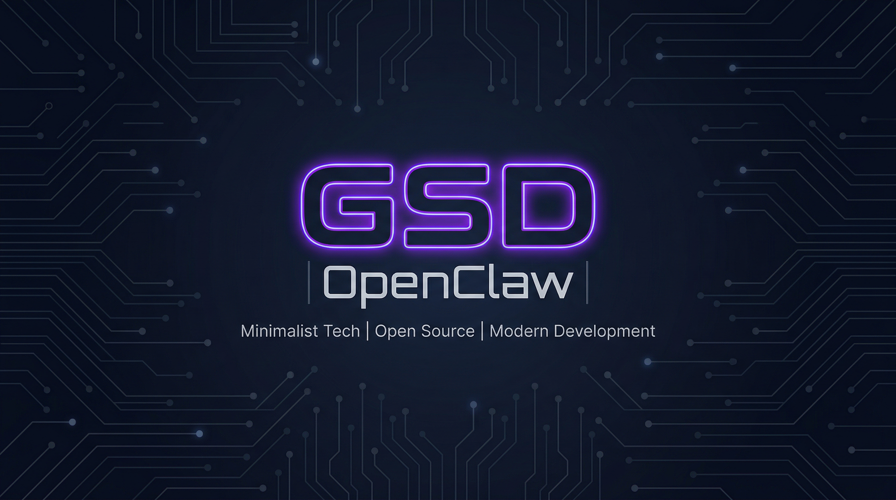

<p align="center">
  
</p>

<h1 align="center">🚀 GSD-OpenClaw</h1>

<p align="center">
  <strong>Spec-Driven Development for Multi-Agent Teams</strong><br/>
  A structured workflow framework that brings <a href="https://github.com/gsd-build/get-shit-done">Get Shit Done (GSD)</a> methodology to <a href="https://openclaw.ai">OpenClaw</a> multi-agent orchestration.
</p>

<p align="center">
  <a href="#-features"></a>
  <a href="#-quick-start"></a>
  <a href="CHANGELOG.md"></a>
  <a href="LICENSE"></a>
</p>

---

## 🤔 What Is This?

**GSD-OpenClaw** adapts the [Get Shit Done](https://github.com/gsd-build/get-shit-done) spec-driven development methodology for **OpenClaw's multi-agent architecture** — where you don't have one developer, you have an entire virtual team of AI agents working in parallel.

### The Problem

When you orchestrate multiple AI agents (developers, QA, architects, UX designers), things go sideways fast:

- 🔀 **Field name mismatches** between frontend and backend agents
- 🔁 **QA loops 3-5 rounds** because the spec wasn't clear
- 🧠 **Context rot** in long sessions — agent output quality degrades
- 🤷 **No handoff protocol** — next agent doesn't know what the previous one did
- 📋 **Scope creep** — agents add features nobody asked for

### The Solution

GSD-OpenClaw provides a **structured workflow** that forces planning before coding:

```
📋 Requirements → 🔬 Research → 📐 Plan → ⚡ Execute (Waves) → 🧪 QA → ✅ Ship
```

Every stage has clear inputs, outputs, owners, and verification gates — specifically designed for **agent-to-agent handoffs**.

---

## ✨ Features

| Feature | Description |
|---------|-------------|
| 🎯 **Spec-Driven Development** | No more "just wing it" — every task starts with requirements and a verified plan |
| 🌊 **Wave-Based Execution** | Parallel task groups with dependency tracking — maximize agent throughput |
| 📦 **Session Handoff Protocol** | `HANDOFF.json` ensures clean context transfer between agent sessions |
| 🧪 **Cross-Phase Regression Gate** | QA tests previous phases too — catch regressions early |
| ✅ **Requirements Coverage Gate** | Plan verification ensures every requirement maps to a task |
| 🔍 **Stub Detection** | Catches TODO/FIXME/placeholder code before it reaches production |
| ⚡ **3-Tier Task Sizing** | Fast / Quick / Full GSD — right-sized workflow for every task |
| 🔀 **Workstream Namespacing** | Run multiple milestones in parallel without `.planning/` conflicts |
| 🔬 **Post-Mortem Forensics** | Structured investigation when workflows go wrong |
| 👥 **Role-Based Ownership** | Clear responsibilities: Coordinator, Architect, Dev Pool, QA Pool, UX Pool |
| 📊 **Context Size Limits** | Prevents context window overflow with document size caps |
| 🔄 **Upstream Tracking** | Stay current with GSD releases — cherry-pick what matters |

---

## 📁 Project Structure

```
your-project/
└── .planning/
    ├── PROJECT.md              # Vision, scope, tech stack
    ├── REQUIREMENTS.md         # v1/v2/out-of-scope
    ├── ROADMAP.md              # Phases mapped to requirements
    ├── STATE.md                # Current state & blockers
    ├── config.json             # Workflow settings
    ├── phases/
    │   ├── phase-1-api-setup/
    │   │   ├── CONTEXT.md      # Implementation decisions
    │   │   ├── RESEARCH.md     # Technical research & pitfalls
    │   │   ├── PLAN-01.md      # Atomic task plan
    │   │   ├── UI-SPEC.md      # Design contract (if UI)
    │   │   ├── SUMMARY.md      # What was built
    │   │   ├── HANDOFF.json    # Session handoff artifact
    │   │   ├── FORENSICS.md    # Post-mortem (if needed)
    │   │   └── QA.md           # QA report
    │   └── phase-2-frontend/
    │       └── ...
    ├── workstreams/            # Parallel milestone work
    ├── research/               # Domain research cache
    ├── quick/                  # Ad-hoc task plans
    └── threads/                # Cross-session context
```

---

## ⚡ Quick Start

### 1. Install

Clone this repo into your OpenClaw workspace:

```bash
cd ~/.openclaw/workspace
git clone https://github.com/Chaturaphut/gsd-openclaw.git config/gsd-openclaw
```

Or copy the workflow file directly:

```bash
# Copy just the workflow file
curl -o config/gsd-workflow.md \
  https://raw.githubusercontent.com/Chaturaphut/gsd-openclaw/main/workflow/gsd-workflow.md
```

### 2. Reference in Your Agent Config

Add to your `AGENTS.md` or `RULES.md`:

```markdown
## GSD Workflow
- Full doc: `config/gsd-openclaw/workflow/gsd-workflow.md`
- Every Dev task must follow: Spec → Research → Plan → Execute → QA
- Quick Mode: ≤3 files + no new API
- Fast Mode: 1 file, ≤20 lines change
```

### 3. Create Your First Project Plan

```markdown
# .planning/PROJECT.md

## Project: My Feature
- **Goal:** [What you're building]
- **Tech Stack:** [Your stack]
- **Constraints:** [Timeline, dependencies]
- **Success Criteria:** [How to measure done]
```

### 4. Let Your Agents Work

Your coordinator agent (or you) orchestrates the workflow:

```
1. Define requirements → REQUIREMENTS.md
2. Spawn research agents → RESEARCH.md
3. Create plan → PLAN-01.md (verify before execute!)
4. Execute in waves → Dev agents work in parallel
5. QA verification → QA.md report
6. Ship it 🚀
```

---

## 🔄 Workflow Stages

### Stage 0: Map Codebase (Brownfield Only)
> When adding features to existing projects

Analyze the existing codebase and document:
- `STACK.md` — Tech versions & frameworks
- `ARCHITECTURE.md` — Project structure & patterns
- `CONVENTIONS.md` — Naming & formatting standards
- `CONCERNS.md` — Known tech debt & fragile areas

### Stage 1: Define Requirements
> Every project starts here

| Check | Description |
|-------|-------------|
| ✅ Goals | Clear WHAT, not HOW |
| ✅ Scope | v1 (must) / v2 (nice-to-have) / out-of-scope |
| ✅ Constraints | Tech stack, timeline, dependencies |
| ✅ Success Criteria | Measurable outcomes |

### Stage 2: Research (Parallel)
> Spawn 2-4 researcher agents simultaneously

- **Stack Researcher** — Library options, version compatibility
- **Architecture Researcher** — Design patterns, data flow
- **Pitfalls Researcher** — Common mistakes, edge cases, security
- **Domain Researcher** — Business logic, industry standards

Output: `RESEARCH.md` (≤3,000 words — actionable insights only)

### Stage 3: Plan
> The most critical stage — get this right, everything flows

```markdown
## Task 1: [name]
- **Files:** [list of files to create/modify]
- **Dependencies:** [other tasks that must complete first]
- **Wave:** [1/2/3 — parallel grouping]
- **Action:** Step-by-step implementation instructions
- **Verify:** How to test this task
- **Done When:** Acceptance criteria
```

**Plan Verification Checklist:**
- [ ] Every requirement has a mapped task
- [ ] No scope creep beyond v1
- [ ] API schemas match between frontend/backend tasks
- [ ] Dependencies are acyclic and complete
- [ ] File paths match project structure
- [ ] No field name mismatches (!!!)

### Stage 4: Execute (Wave-Based)
> Maximize parallelism, respect dependencies

```
Wave 1: Independent tasks (parallel)
         Task A (Backend API)  |  Task B (DB Schema)
                    ↓                     ↓
Wave 2: Depends on Wave 1
         Task C (Frontend — needs API from Task A)
                    ↓
Wave 3: Integration
         Task D (Wire up + end-to-end test)
```

### Stage 5: QA & Verify
> Against the plan, not just "does it look right"

- Verify against `PLAN.md` done criteria
- Compare UI vs API schema from plan
- Check every edge case from `RESEARCH.md`
- Run previous phase test suites (regression gate)
- Grep for stubs/TODOs in production code

---

## ⚡ Task Sizing Guide

| Mode | When | Plan | Research | QA |
|------|------|------|----------|-----|
| 🏎️ **Fast** | 1 file, ≤20 lines | ❌ Skip | ❌ Skip | Spot check |
| 🚗 **Quick** | ≤3 files, no new API | Brief plan | ❌ Skip | Full QA |
| 🚀 **Full GSD** | >3 files or new API | Full plan | ✅ Required | Full QA |

---

## 📦 Session Handoff Protocol

When an agent completes a phase, it creates `HANDOFF.json`:

```json
{
  "phase": "phase-1-api-setup",
  "status": "complete",
  "completedTasks": ["task-1", "task-2", "task-3"],
  "pendingTasks": [],
  "decisions": [
    {
      "id": "D001",
      "summary": "Used Redis for session caching",
      "reason": "10x faster than DB-backed sessions"
    }
  ],
  "blockers": [],
  "nextSteps": ["Start phase-2 frontend integration"],
  "modifiedFiles": [
    "src/api/routes.ts",
    "src/services/auth.ts",
    "src/middleware/session.ts"
  ],
  "timestamp": "2026-03-26T10:00:00Z"
}
```

The next agent reads this before starting — **no context lost between sessions**.

---

## 🔍 Quality Gates

### Requirements Coverage Gate
Before executing a plan, verify every requirement maps to at least one task:
```
✅ Requirement 1 → Task 2, Task 5
✅ Requirement 2 → Task 1
✅ Requirement 3 → Task 3, Task 4
❌ Requirement 4 → NO TASK MAPPED ← Block execution!
```

### Stub Detection
QA agents grep for incomplete implementations before accepting work:
```bash
grep -rn "TODO\|FIXME\|HACK\|PLACEHOLDER\|Not implemented\|// stub" src/
```
Found in production code = **BUG** → sent back to developer.

### Cross-Phase Regression Gate
After Phase N execution, QA runs Phase 1..N-1 test suites:
```
Phase 3 complete → Run Phase 1 tests ✅ → Run Phase 2 tests ✅ → Phase 3 tests ✅ → PASS
Phase 3 complete → Run Phase 1 tests ✅ → Run Phase 2 tests ❌ → REGRESSION → Fix first
```

---

## 📊 Context Size Limits

To prevent context window overflow and output quality degradation:

| Document | Max Size | Notes |
|----------|----------|-------|
| `PROJECT.md` | 2,000 words | Vision only |
| `REQUIREMENTS.md` | 3,000 words | Bullet points |
| `RESEARCH.md` | 3,000 words | Actionable findings |
| `PLAN.md` (per plan) | 2,000 words | One plan per task group |
| Agent instruction | 4,000 words | Plan + context combined |
| `SUMMARY.md` | 1,000 words | What changed, not why |

---

## 👥 Role Assignments

GSD-OpenClaw is designed for teams with these roles:

| Role | Responsibility |
|------|---------------|
| 🎯 **Coordinator** | Requirements, plans, wave orchestration, STATE.md tracking |
| 🏗️ **Solution Architect** | Plan verification, API schema review, architecture fit |
| 💻 **Dev Pool** | Execute tasks per PLAN.md — no scope changes without approval |
| 🧪 **QA Pool** | Verify against plan criteria, regression testing, stub detection |
| 🎨 **UX Pool** | UI-SPEC creation, design review, responsive verification |

---

## 🆚 GSD-OpenClaw vs Original GSD

| Aspect | Original GSD | GSD-OpenClaw |
|--------|-------------|--------------|
| **Target** | Single developer + Claude Code | Multi-agent teams on OpenClaw |
| **Execution** | Sequential | Wave-based parallel execution |
| **Handoff** | Session-based | `HANDOFF.json` protocol |
| **QA** | Verification phase | Full QA loop with regression gates |
| **Roles** | Developer + AI | Coordinator + SA + Dev Pool + QA Pool + UX Pool |
| **Task Sizing** | Full vs lightweight | 3-tier: Fast / Quick / Full |
| **Parallel Work** | Single milestone | Workstream namespacing |
| **Context** | Managed by GSD CLI | Size limits + handoff artifacts |

---

## 🗺️ Roadmap

- [x] Core workflow (Spec → Research → Plan → Execute → QA)
- [x] Wave-based parallel execution
- [x] Session Handoff Protocol (`HANDOFF.json`)
- [x] Cross-Phase Regression Gate
- [x] Requirements Coverage Gate
- [x] Stub Detection
- [x] 3-Tier Task Sizing (Fast/Quick/Full)
- [x] Workstream Namespacing
- [x] Post-Mortem Forensics
- [x] Upstream GSD Tracking (automated weekly)
- [ ] OpenClaw Skill package (auto-install via ClawHub)
- [ ] Interactive workflow dashboard
- [ ] Agent performance analytics per workflow
- [ ] Auto-plan generation from requirements
- [ ] Integration with GitLab/GitHub Issues

---

## 🙏 Credits

- **[Get Shit Done (GSD)](https://github.com/gsd-build/get-shit-done)** by TÂCHES — The original spec-driven development system for Claude Code. GSD-OpenClaw adapts its methodology for multi-agent orchestration.
- **[OpenClaw](https://openclaw.ai)** — The AI agent platform that makes multi-agent workflows possible.

---

## 📄 License

MIT License — see [LICENSE](LICENSE) for details.

---

<p align="center">
  <strong>Stop winging it. Start shipping it.</strong><br/>
  Built with 💜 by <a href="https://github.com/Chaturaphut">Chaturaphut</a> for the OpenClaw community.
</p>
