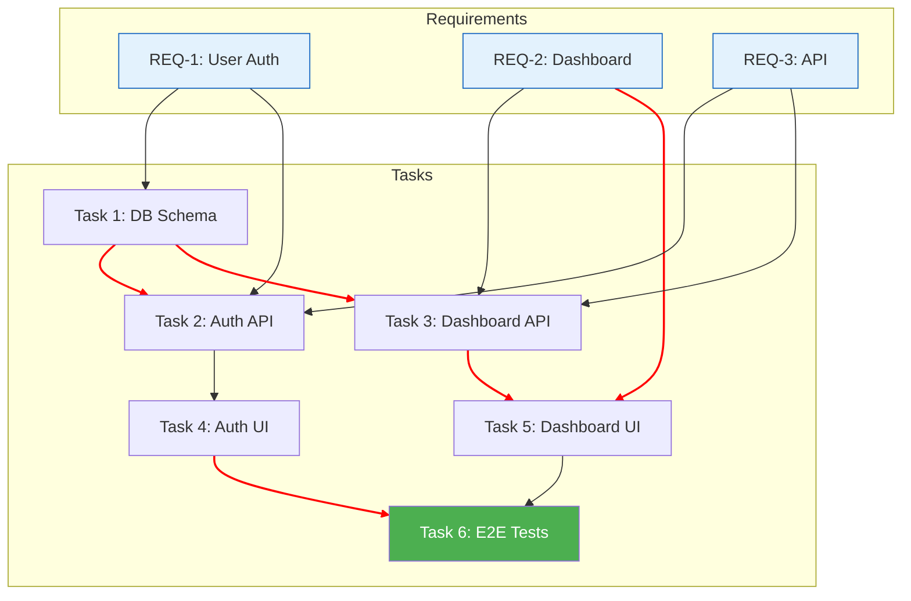

# Dependency Graph Template

Visualize task dependencies and critical path.

## Reading the Graph

- **Red lines** = Critical path (longest dependency chain)
- **Blue boxes** = Requirements (source)
- **Green box** = Final integration task
- Each arrow means "must complete before"
