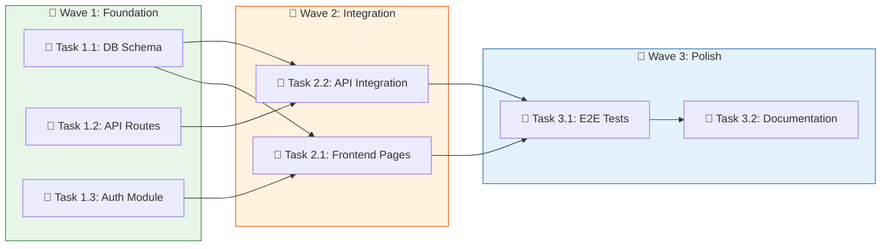

# Wave Execution Template

Visualize parallel task execution across waves.

```mermaid
flowchart LR
    subgraph Wave1[🌊 Wave 1: Foundation]
        direction TB
        T1[🔧 Task 1.1: DB Schema]
        T2[🔧 Task 1.2: API Routes]
        T3[🔧 Task 1.3: Auth Module]
    end

    subgraph Wave2[🌊 Wave 2: Integration]
        direction TB
        T4[🔧 Task 2.1: Frontend Pages]
        T5[🔧 Task 2.2: API Integration]
    end

    subgraph Wave3[🌊 Wave 3: Polish]
        direction TB
        T6[🔧 Task 3.1: E2E Tests]
        T7[🔧 Task 3.2: Documentation]
    end

    T1 --> T4
    T2 --> T5
    T1 --> T5
    T3 --> T4
    T4 --> T6
    T5 --> T6
    T6 --> T7

    style Wave1 fill:#E8F5E9,stroke:#2E7D32
    style Wave2 fill:#FFF3E0,stroke:#E65100
    style Wave3 fill:#E3F2FD,stroke:#1565C0
```
