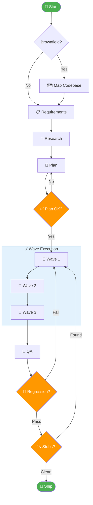

# Workflow Stages Flowchart Template

Copy and customize this Mermaid diagram for your project.

```mermaid
flowchart TD
    Start([🚀 Start]) --> Map{Brownfield?}
    Map --> |Yes| Codebase[🗺️ Map Codebase]
    Map --> |No| Req
    Codebase --> Req[📋 Requirements]
    Req --> Research[🔬 Research]
    Research --> Plan[📐 Plan]
    Plan --> Verify{✅ Plan OK?}
    Verify --> |No| Plan
    Verify --> |Yes| Wave1

    subgraph Execution[⚡ Wave Execution]
        Wave1[🌊 Wave 1] --> Wave2[🌊 Wave 2]
        Wave2 --> Wave3[🌊 Wave 3]
    end

    Wave3 --> QA[🧪 QA]
    QA --> RegGate{🔄 Regression?}
    RegGate --> |Pass| StubGate{🔍 Stubs?}
    RegGate --> |Fail| Wave1
    StubGate --> |Clean| Ship([🚢 Ship])
    StubGate --> |Found| Wave1

    style Start fill:#4CAF50,color:#fff
    style Ship fill:#4CAF50,color:#fff
    style Verify fill:#FF9800,color:#fff
    style RegGate fill:#FF9800,color:#fff
    style StubGate fill:#FF9800,color:#fff
    style Execution fill:#E3F2FD,stroke:#1565C0
```
